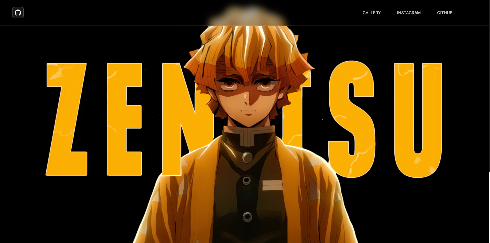
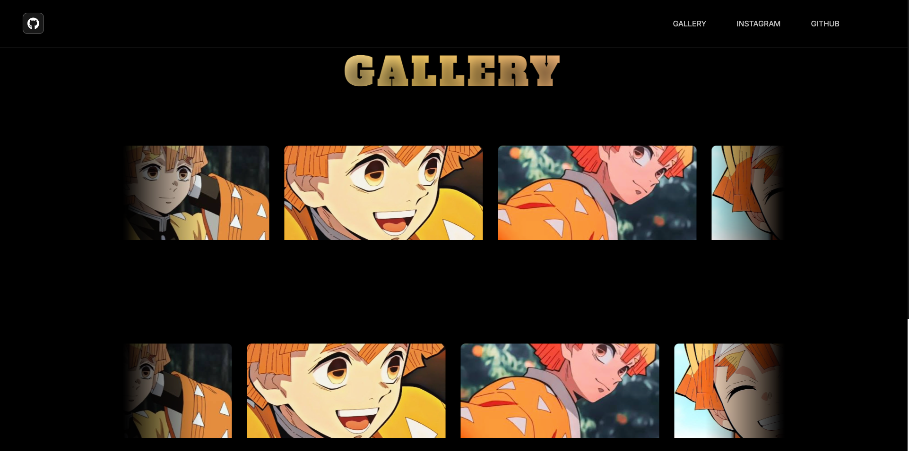
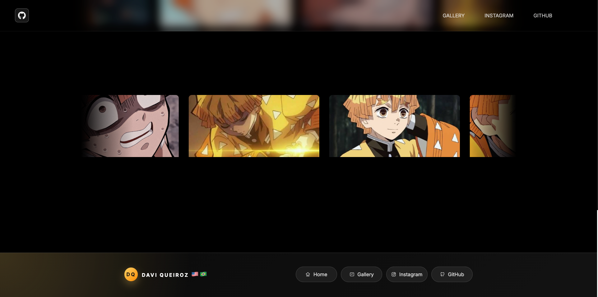

# ⚡⚡️ Zenitsu Fanpage (July 20th - 21st, 2026)

A fully responsive fanpage dedicated to Zenitsu Agatsuma from Demon Slayer, built with HTML, CSS, and a small amount of JavaScript.

After finishing the HTML & CSS course, I wanted one final project where I could forget tutorials and simply build.

Instead of making another business landing page, I decided to create something I actually enjoy. This project became an opportunity to combine almost everything I’d learned over the past month into one polished website while experimenting with cleaner layouts, animations, component organization, and even my first JavaScript interactions.

This wasn’t about learning new HTML or CSS concepts.

It was about proving to myself that I could actually build something from scratch.

⸻

## Live Demo 🌐 : 

https://davi-sousa-queiroz.github.io/zenitsu-fanpage/

## Preview 📷 :

## 🚀 Features

* Fully responsive layout
* Cinematic fullscreen video hero
* Glassmorphism navigation bar
* Infinite scrolling image carousels
* Smooth scrolling navigation
* Hover animations
* CSS transitions & transforms
* Scroll reveal animation
* Animated heading
* Custom footer
* External social links
* Small JavaScript scroll interaction

⸻

## 🛠️ Built With

* HTML5
* CSS3
* JavaScript
* Flexbox
* CSS Grid
* Media Queries
* CSS Animations
* CSS Transitions
* CSS Transforms
* Glassmorphism
* Git
* GitHub Pages

⸻

## 📚 What I Practiced

This project wasn’t about following a tutorial anymore.

It was about making decisions myself.

During development I practiced:

* Building sections independently before combining them
* Better HTML structure
* Organizing larger CSS files
* Responsive layouts
* Flexbox
* CSS Grid
* Component thinking
* Naming classes consistently
* Creating reusable styles
* Animations
* Transitions
* Glassmorphism
* JavaScript DOM manipulation
* Intersection Observer API

⸻

## 📖 What I Learned

This project felt different from everything I’d built before.

Instead of constantly searching how to do every little thing, I already knew most of the tools. The challenge became deciding how I wanted to build it.

I spent much more time thinking about spacing, typography, layouts, colors, animations, and overall polish than I did figuring out basic HTML or CSS.

It also became my first project where I started introducing small JavaScript interactions instead of relying purely on CSS.

Looking back, this feels like the project that closed the HTML & CSS chapter for me.

⸻

## 📈 Project Stats

* ⏱️ Built after finishing my HTML & CSS course
* 🎬 First website using a fullscreen video hero
* 🖼️ First infinite image carousel
* ✨ First project combining HTML, CSS, and JavaScript
* 📱 Fully responsive
* 🧠 Almost entirely built from memory

⸻

## 🚀 Future Improvements

* Rebuild it using JavaScript modules
* Add image modal/gallery viewer
* Keyboard navigation
* Better accessibility
* More interactive animations
* Recreate it later with React

⸻

## 💭 Note To Future Me

Hey future Davi,

This wasn’t supposed to be some massive portfolio piece.

It was simply your final HTML & CSS project.

A month ago you were struggling to center a div. Now you’re building responsive websites with animated heroes, glassmorphism, JavaScript interactions, and layouts that you actually designed yourself.

That’s easy to forget.

This project marks the end of one chapter.

Tomorrow you start JavaScript for real.

Everything after this gets bigger.

Keep this project around—not because it’s perfect, but because one day you’ll look back at it and realize how much your standards have changed.

Now go learn JavaScript.

## — Davi 🧑‍💻
